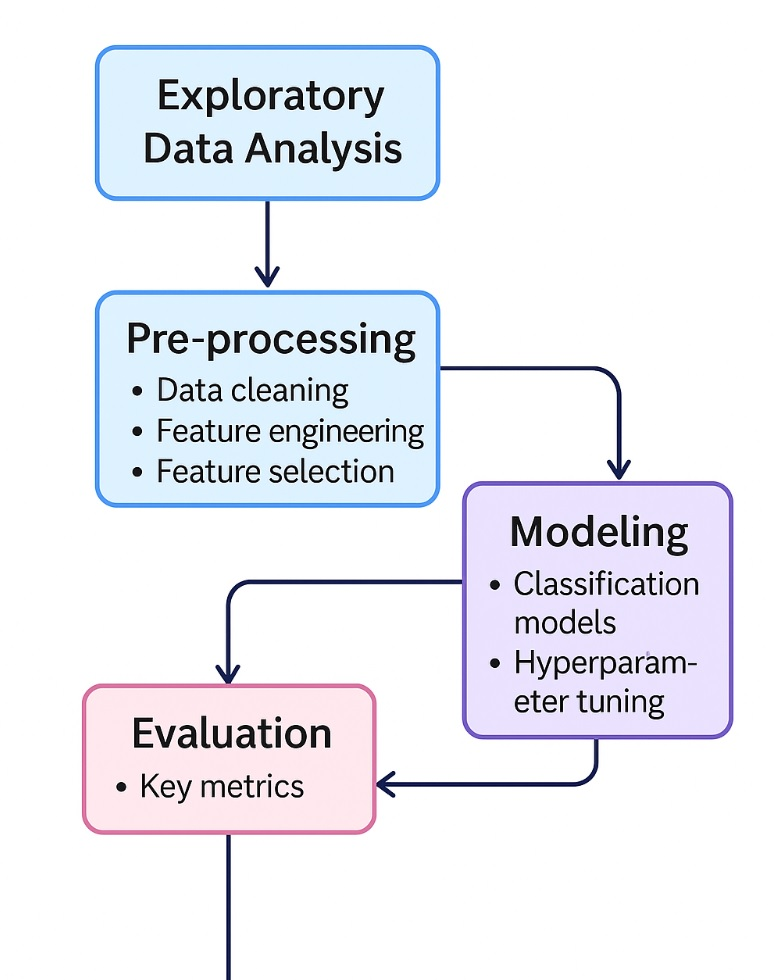

# 🚀 Fraud Detection

## 📝 Project Overview
This project builds a machine learning pipeline to detect fraudulent transactions efficiently. It involves:
- **Exploratory Data Analysis (EDA)**
- **Data Pre-processing**
- **Feature Engineering & Selection**
- Handling **class imbalance** using SMOTE
- Training multiple **classification models**
- **Hyperparameter tuning** for performance optimization
- **Evaluation** using multiple robust metrics
- Selection of the **best performing model** based on ROC AUC

## 📊 Conceptual Structure


## 🔧 Installation
1. Clone the repository
2. Create a virtual environment:
   ```bash
   python -m venv venv
   source venv/bin/activate  # For Unix/Linux
   venv\Scripts\activate   # For Windows
   ```
3. Install dependencies:
   ```bash
   pip install -r requirements.txt
   ```
## ⚙️ Running the App
1. Running the Fraud Detection App from Terminal:
   ```bash
   streamlit run fraud_detection_app.py
   ```

## 📊 Dataset Description
The dataset contains **99,615** transactions with the following fields:
- `originator`: Bank sending the transaction
- `beneficiary`: Bank receiving the transaction
- `date`: Transaction date (YYMMDD)
- `time`: Transaction time (HHMM)
- `type`: Message type (e.g., MT103, MT202)
- `currency`: Currency code (all converted to USD)
- `value`: Transaction amount
- `aggregate_value`: Total transaction value to a country in the last 2 hours
- `aggregate_volume`: Number of transactions to a country in the last 2 hours
- `flag`: 0 (Normal) / 1 (Fraud)

## 🧹 Data Pre-processing
- **Feature Extraction**: Country codes from bank codes, Hour of transaction from time
- **Data Cleaning**: Dropping irrelevant columns and handling missing values
- **Feature Engineering**: Log transformation to reduce skewness
- **Encoding**: Label encoding of categorical variables
- **Outlier Treatment**: Capping outliers using the Interquartile Range (IQR) method
- **Scaling**: StandardScaler for numerical stability
- **Feature Selection**: ANOVA F-test to select top important features

## 🤖 Machine Learning Models
- **Logistic Regression**
- **Random Forest**
- **XGBoost** 
- **LightGBM**
- **SVM**

## ⚙️ Model Training Pipeline
- **Pipeline Structure**: Scaling ➔ Modeling
- **Imbalanced Data Handling**: SMOTE oversampling
- **Hyperparameter Tuning**: GridSearchCV with ROC AUC as the scoring metric
- **Cross-Validation**: 3-fold CV for robustness

## 📈 Evaluation Metrics
- **Accuracy**: Overall correctness
- **Precision**: Focus on the true fraud predictions
- **Recall (Sensitivity)**: Focus on catching as many frauds as possible
- **F1-Score**: Balance between precision and recall
- **ROC AUC Score**: Overall model performance
- **Confusion Matrix**: True/False Positives/Negatives
- **Precision-Recall Curve**: Very important for imbalanced datasets

## 🥇 Model Selection
The model with the highest **ROC AUC Score** and best **Recall** is selected to balance fraud detection while minimizing false negatives

## 📚 References
- [Scikit-learn Documentation](https://scikit-learn.org/stable/)
- [Imbalanced-learn Documentation](https://imbalanced-learn.org/stable/)
- [XGBoost Documentation](https://xgboost.readthedocs.io/en/latest/)
- [LightGBM Documentation](https://lightgbm.readthedocs.io/)

---

